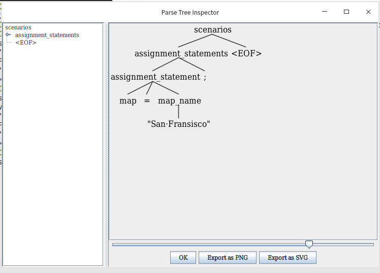

# AVScenarios
1. 如何运行``grammar/AVScenarios.g4``文件
    1. 请确保您安装``antlr4``
        > 官网安装[antlr4](https://www.antlr.org/download/antlr-4.8-complete.jar)    
    2. 安装的文件为``antlr-4.8-complete.jar``
    3. 在``Ubuntu``系统上设置以下几个别名  
       ```shell
       alias antlr4='java -jar <path>/antlr-4.8-complete.jar'
       alias grun='java -cp .:<path>/antlr-4.8-complete.jar org.antlr.v4.gui.TestRig'                                     
       ```
       ``path``为``antlr-4.8-complete.jar``的路径<br />
       或者将``antlr-4.8-complete.jar``目录设置到``CLASSPATH``环境变量中：<br />
       ```shell script
       export CLASSPATH=".:<path>/antlr-4.8-complete.jar:$CLASSPATH"
       alias antlr4='java -jar antlr-4.8-complete.jar'
       alias grun='java -cp  org.antlr.v4.gui.TestRig' 
       ```
    3. 使用``antlr4``命令生成解析代码
        1. ``antlr4 -no-listener -no-visitor  AVScenarios.g4 -o ./gen ``
            在``gen``目录下将会生成一下几个文件用于词法与语法分析
            这些文件用于对``AVScenarios.g4``文法进行处理
        2. 切换到``gen``目录下，``cd gen``
        2. 编译``javac -cp <path>/antlr-4.8-complete.jar *.java``<br />
            如果您已经设置了``CLASSPATH``环境变量，则只需要``javac *.java`` 
        3. ``grun AVScenarios <rule-name> -tokens``
           <br />``rule-name``为文法规则名字，如果您对``antlr4``文法不了解的话，只需默认的
           输入``scenarios``即可，所有的规则名字在``AVScenarios.g4``中都可以找到
           <br />上述命令会等待输入符合文法描述的代码（使用``ctrl+D``表示``EOF``），并将词法打印的结果输出
           例如：
           ```shell script
           grun AVScenarios scenarios -tokens
           map="San Fransisco";[enter][ctrl+D]
           ```  
           输出如下：
           ```shell script
            [@0,0:2='map',<Variable_name>,1:0]
            [@1,3:3='=',<'='>,1:3]
            [@2,4:18='"San Fransisco"',<String>,1:4]
            [@3,19:19=';',<';'>,1:19]
            [@4,21:20='<EOF>',<EOF>,2:0]
           ```
        4. ``grun AVScenarios <rule-name> -gui``<br />将会打印抽象语法树
            例如：
            ```shell script
            grun AVScenarios scenarios -gui
            map="San Fransisco";[ctrl+D]
            ```
           您将会看到一副表示抽象语法树的图像
           
        5. ``grun AVScenarios <rule-name> -gui filename``
            将会以*filename*文件作为标准输入解析
    4. ``antlr4``可以设置解析代码的语言，默认是``java``，您还可以设置``python3``
    ，即``antlr4 -no-listener -no-visitor -DLanguage=Python3 AVScenarios.g4 -o ./gen ``
    这将会生成``Python3``的前端分析代码